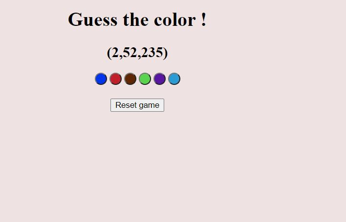
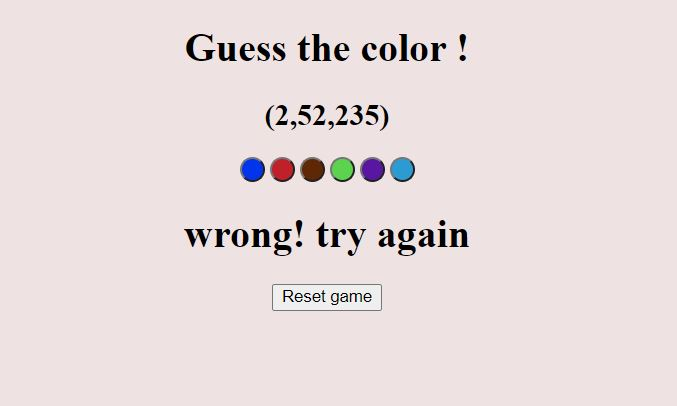
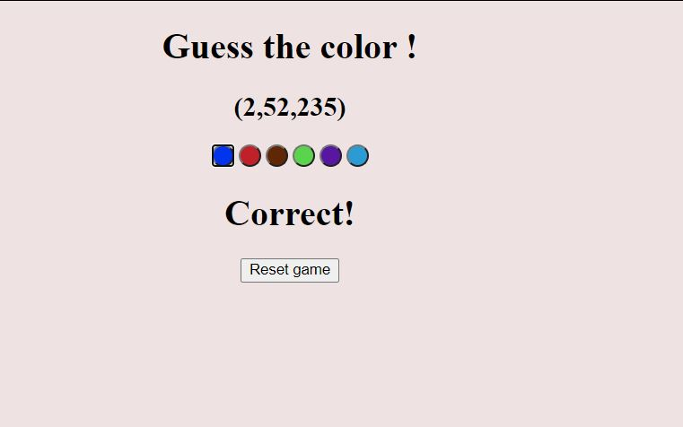
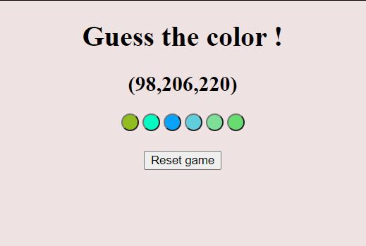

# Guess-the-color

### Technologies Used
* HTML
* CSS
* JavaScript

### DEMO

We need to guess the color from the rgb value of color
 
We will get the result if it is wrong or correct
 
We can also reset the game
 

   
  
   
  
   
  
   
  
   

